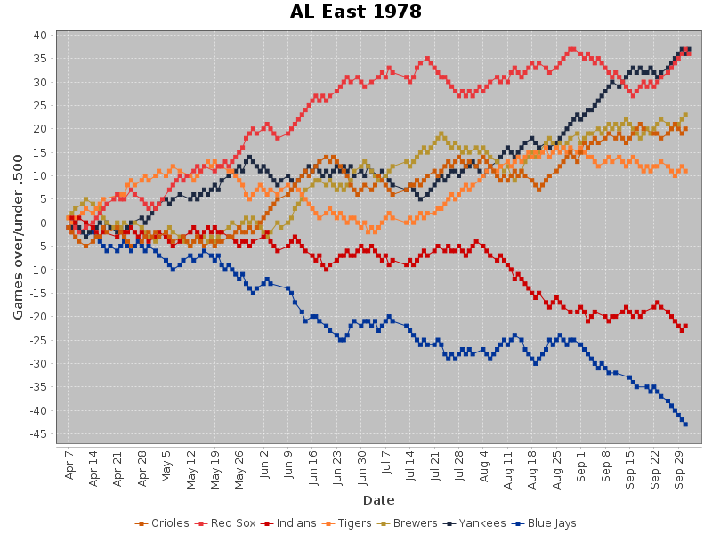

### Pennant Race Chart Generator
This program generates pennant race charts for Major League Baseball seasons.
The chart displays games above .500 in the y-axis and the date in the
y-axis:



#### Building
Build using Gradle:

```
./gradlew clean build copyDependencies
```

All the dependencies are in Maven Central

#### Running
You will need a source of data for the seasons you want to graph. 

Retrosheet game logs are best for historical seasons. They go back to 1871 and the current year's data is usually 
available in December. There are available 
[here](https://www.retrosheet.org/gamelogs/index.html).  Download
the years you're interested in and unzip them.

Current data can be downloaded from MLB's API. To get the current year's worth of data:
```bash
curl "https://statsapi.mlb.com/api/v1/schedule?sportId=1&startDate=2024-03-20&endDate=2024-09-30" > mlb-2024.json
```
                              
Place the game data in the gamelogs subdirectory. By default, the program uses data in Retrosheet format. To use
MLB API data, add "--data.source.type=mlbapi" to the end of the command.

Once you have the data you want, you can:
* Run the script with just the year and get all leagues or divisions:
```bash
runPennantRaceCharts.sh 2021
```
* Run the script with the year and a comma separated list of league or division abbreviations:
```bash
runPennantRaceCharts.sh 1978 ALE,ALW
```
* Run the script with the year and a comma separated list of team names. You must specify a title and file name:
```bash
runPennantRaceCharts.sh 2021 BOS,NYA,TOR,SEA --title="AL Wildcard" --file.name=al_wildcard_2021.png
```

Divisions/Leagues can be AL, NL, ALE, ALC, ALW, NLE, NLC, NLW.  NL and AL only work for 1968 and earlier, before divisions 
were created. NLC and ALC work only after 1993 when the central divisions were created.

The charts will be written to the top level project directory.
